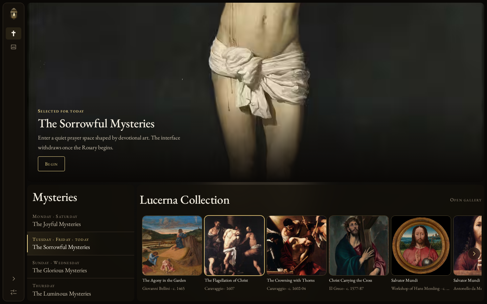

# Lucerna&trade;

Lucerna is free to use, private by design, and built for offline access. Once installed, it does not need a server during normal use.

## Why Lucerna

Lucerna is for anyone who wants to learn the Rosary. The guidance walks you through each mystery, and you can switch it off once you no longer need it. What stays is the Scripture, the artwork, and the room to meditate on the mysteries as you pray.

<p align="center">
  
</p>

## What it does

- Provides a complete traditional Rosary, including the optional Fatima prayers.
- Offers optional guided prayer, tied to the real bead or chain position of each step.
- Features the Lucerna Collection, the curated works browsable by mystery, artist, or fifty year period.
- Bundles Scripture, artwork, credits, and sources for offline access and reduced network traffic.
- Stores preferences on the device. No accounts, advertising, analytics, or tracking.
- Keeps the last error report on the device, and sends it only if you choose to send it.

## Offline behavior

Installing Lucerna as an app reduces your alliance to a network connection and allows it to function offline.

[Add Lucerna to your device](docs/INSTALL.md) has the steps for every browser.

## Roadmap

These are the directions Lucerna may grow in. None of them are commitments to ship.

- Scripture reading and browsing
- Additional prayers and devotions
- Liturgical calendar and feast day context
- More guided prayer experiences
- More artwork and source material
- More accessibility and personalization options

No subscriptions, accounts, advertising, or tracking. Ever.

## Support

[lucerna@wedefendit.com](mailto:lucerna@wedefendit.com)

Diagnostics are never sent automatically. Nothing leaves the device unless you select **Email diagnostics**.

## License and rights

The deployed application is free to use. The source and original design are proprietary, and this repository grants no permission to copy, modify, or redistribute them.

Bundled texts and artworks keep the rights recorded with their credits. [Lucerna References](docs/REFERENCES.md) lists every source.

Lucerna™ is a trademark of Anthony Tropeano.

Copyright &copy; 2026 [Anthony Tropeano](https://github.com/iiTONELOC). All rights reserved.

---

## Development

Requires Bun 1.3.14. Vite, React, TypeScript, Tailwind CSS, Oxlint, Prettier, Playwright.

```bash
bun install --frozen-lockfile
bun run dev
```

Checks:

```bash
bunx tsc -b
bun test
bun run lint
bun run format:check
bun run build
bun run test:e2e
```
